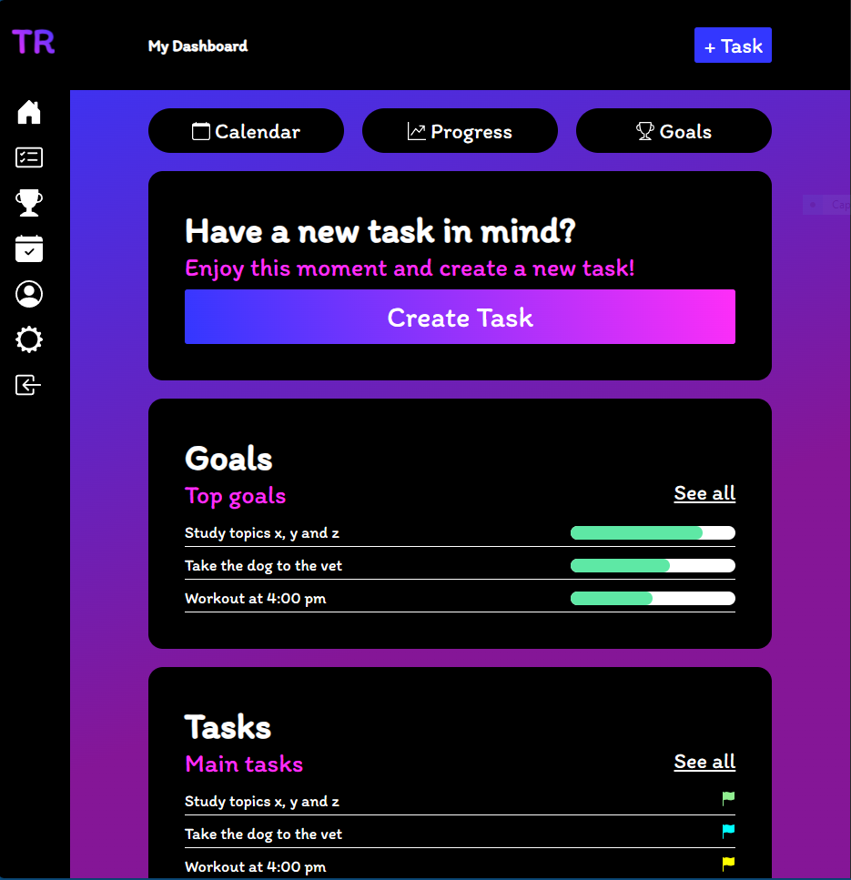
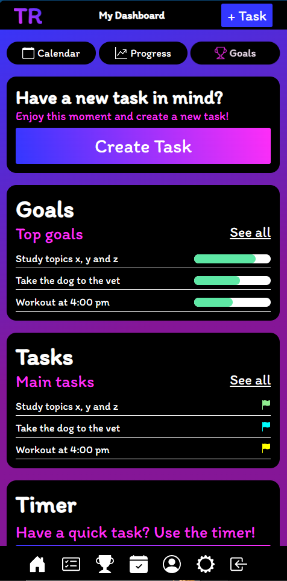
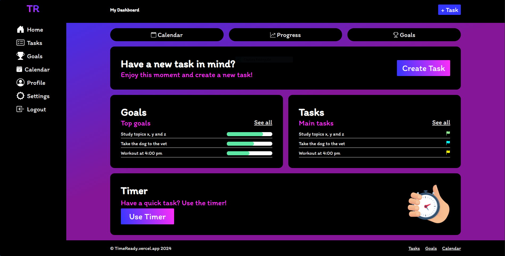

# TimeReady

## About
Application with the aim of helping the user to have a more organized life, making their day more agile and productive, allowing them to reap great results.

# Stack

HTML, CSS, JavaScript, TypeScript, Angular, Java, Node.js.

## How to run
Run `ng serve` for a dev server. Navigate to `http://localhost:4200/`. The application will automatically reload if you change any of the source files.

## Screenshots

